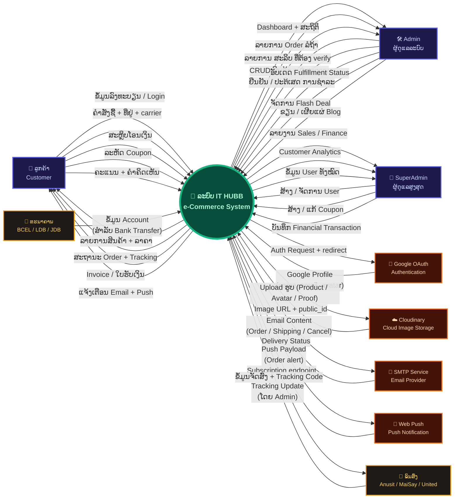

# IT HUBB — DFD Level 0 (Context Diagram)

> ແຜນຜັງການໄຫຼຂໍ້ມູນລະດັບ 0 — ສະແດງລະບົບທັງໝົດເປັນ process ດຽວ  
> ພ້ອມ External Entities ທີ່ຕິດຕໍ່ກັບລະບົບ ແລະ ທິດທາງການໄຫຼຂໍ້ມູນ



---

## 📋 ສຸດທ້າຍ External Entities

| Entity | ປະເພດ | Data Flow ເຂົ້າລະບົບ | Data Flow ອອກຈາກລະບົບ |
|--------|--------|----------------------|----------------------|
| 👤 **ລູກຄ້າ** | Human Actor | ລົງທະບຽນ, ຄຳສັ່ງ, ສະຫຼິບ, Coupon, Review | ລາຍການສິນຄ້າ, ສະຖານະ, Invoice, ແຈ້ງເຕືອນ |
| 🛠️ **Admin** | Human Actor | CRUD ສິນຄ້າ, verify ຊຳລະ, update status, FlashDeal, Blog | Dashboard, Order list, Payment proofs |
| 👑 **SuperAdmin** | Human Actor | ຈັດການ User, Coupon, Financial record | ລາຍງານ Sales/Finance, Analytics |
| 🔐 **Google OAuth** | External System | Google Profile (name, email, avatar) | Auth redirect request |
| ☁️ **Cloudinary** | External Service | Image URL + public_id | ໄຟລ໌ຮູບ (Product/Avatar/Proof) |
| 📧 **SMTP Email** | External Service | Delivery status | Email content (Order/Ship/Cancel) |
| 🔔 **Web Push** | External Service | Subscription endpoint | Push notification payload |
| 🏦 **ທະນາຄານ** | External System | Bank account info | — (display only) |
| 🚚 **ຂົນສົ່ງ** | External Partner | Tracking update (via Admin) | Ship info + Tracking code |

---

## 🔄 ກຸ່ມ Data Flows ຫຼັກ

```
ລູກຄ້າ  ──► [ລົງທະບຽນ / Auth]     ──► ລະບົບ ──► [ຂໍ້ມູນ Profile]   ──► Google
ລູກຄ້າ  ──► [ຄຳສັ່ງ + ທີ່ຢູ່]       ──► ລະບົບ ──► [ສາລິບ / Status]  ──► ລູກຄ້າ
ລູກຄ້າ  ──► [ສະຫຼິບໂອນ]            ──► ລະບົບ ──► [Email / Push]    ──► ລູກຄ້າ
Admin   ──► [Verify + Update]      ──► ລະບົບ ──► [Dashboard]       ──► Admin
Admin   ──► [CRUD ສິນຄ້າ]          ──► ລະບົບ ──► [Upload Image]    ──► Cloudinary
ລະບົບ   ──► [Tracking Code]        ──► ຂົນສົ່ງ ──► [Update]         ──► ລະບົບ
```
