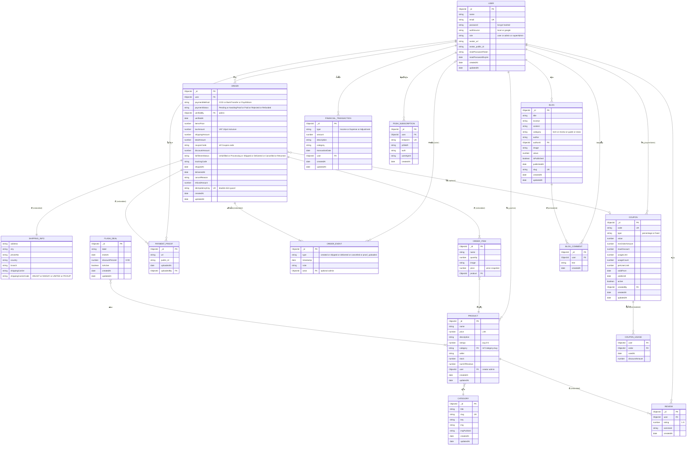

# IT HUBB — Entity Relationship Diagram

```mermaid
erDiagram

    USER {
        ObjectId  _id               PK
        string    name
        string    email             UK
        string    password          "bcrypt hashed"
        string    authSource        "local or google"
        string    role              "user or admin or superAdmin"
        string    avatar_url
        string    avatar_public_id
        string    resetPasswordToken
        date      resetPasswordExpire
        date      createdAt
        date      updatedAt
    }

    PRODUCT {
        ObjectId  _id          PK
        string    name
        number    price        "LAK"
        string    description
        number    ratings      "avg 0-5"
        string    category     FK "ref Category.slug"
        string    seller
        number    stock
        number    numOfReviews
        ObjectId  user         FK "creator admin"
        date      createdAt
        date      updatedAt
    }

    CATEGORY {
        ObjectId  _id         PK
        string    title
        string    slug         UK
        string    key
        string    img
        string    imgPublicId
        date      createdAt
        date      updatedAt
    }

    ORDER {
        ObjectId  _id               PK
        ObjectId  user              FK
        string    paymentMethod     "COD or BankTransfer or PayAtStore"
        string    paymentStatus     "Pending or AwaitingProof or Paid or Rejected or Refunded"
        ObjectId  verifiedBy        FK "admin"
        date      verifiedAt
        number    itemsPrice
        number    taxAmount         "VAT 10pct inclusive"
        number    shippingAmount
        number    totalAmount
        string    couponCode        "ref Coupon.code"
        number    discountAmount
        string    fulfillmentStatus "Unfulfilled or Processing or Shipped or Delivered or Cancelled or Returned"
        string    trackingCode
        date      shippedAt
        date      deliveredAt
        string    cancelReason
        number    refundAmount
        string    idempotencyKey    UK "double-click guard"
        date      createdAt
        date      updatedAt
    }

    SHIPPING_INFO {
        string    address
        string    city
        string    phoneNo
        string    country
        string    branch
        string    shippingCarrier
        string    shippingCarrierCode "ANUSIT or MAISAY or UNITED or PICKUP"
    }

    ORDER_ITEM {
        ObjectId  _id      PK
        string    name
        number    quantity
        string    image
        number    price    "price snapshot"
        ObjectId  product  FK
    }

    REVIEW {
        ObjectId  _id       PK
        ObjectId  user      FK
        number    rating    "1-5"
        string    comment
        date      createdAt
    }

    PAYMENT_PROOF {
        ObjectId  _id        PK
        string    url
        string    public_id
        date      uploadedAt
        ObjectId  uploadedBy FK
    }

    ORDER_EVENT {
        ObjectId  _id       PK
        string    type      "created or shipped or delivered or cancelled or proof_uploaded"
        date      timestamp
        string    note
        ObjectId  actor     FK "optional admin"
    }

    COUPON {
        ObjectId  _id           PK
        string    code          UK
        string    type          "percentage or fixed"
        number    value
        number    minOrderAmount
        number    maxDiscount
        number    usageLimit
        number    usageCount
        number    perUserLimit
        date      validFrom
        date      validUntil
        boolean   active
        ObjectId  createdBy     FK
        date      createdAt
        date      updatedAt
    }

    COUPON_USAGE {
        ObjectId  user           FK
        ObjectId  order          FK
        date      usedAt
        number    discountAmount
    }

    FLASH_DEAL {
        ObjectId  _id            PK
        string    label
        date      endsAt
        number    discountPercent "0-90"
        boolean   isActive
        date      createdAt
        date      updatedAt
    }

    BLOG {
        ObjectId  _id          PK
        string    title
        string    excerpt
        string    content
        string    category     "tech or review or guide or news"
        string    author
        ObjectId  authorId     FK
        string    image
        number    views
        boolean   isPublished
        date      publishedAt
        string    slug         UK
        date      createdAt
        date      updatedAt
    }

    BLOG_COMMENT {
        ObjectId  _id       PK
        ObjectId  user      FK
        string    text
        date      createdAt
    }

    FINANCIAL_TRANSACTION {
        ObjectId  _id             PK
        string    type            "Income or Expense or Adjustment"
        number    amount
        string    description
        string    category
        date      transactionDate
        ObjectId  user            FK
        date      createdAt
        date      updatedAt
    }

    PUSH_SUBSCRIPTION {
        ObjectId  _id       PK
        ObjectId  user      FK
        string    endpoint  UK
        string    p256dh
        string    auth
        string    userAgent
        date      createdAt
    }

    %% ── USER relationships ──────────────────────────
    USER             ||--o{  ORDER                 : "ສ້າງ"
    USER             ||--o{  PRODUCT               : "ສ້າງ (admin)"
    USER             ||--o{  REVIEW                : "ຂຽນ"
    USER             ||--o{  BLOG                  : "ຂຽນ"
    USER             ||--o{  BLOG_COMMENT          : "ຄອມເມັ້ນ"
    USER             ||--o{  COUPON                : "ສ້າງ (superAdmin)"
    USER             ||--o{  FINANCIAL_TRANSACTION : "ບັນທຶກ"
    USER             ||--o{  PUSH_SUBSCRIPTION     : "ລົງທະບຽນ"
    USER             ||--o{  PAYMENT_PROOF         : "ອັບໂຫຼດ"
    USER             |o--o{  ORDER_EVENT           : "ດຳເນີນ (actor)"

    %% ── ORDER structure (embedded docs) ─────────────
    ORDER            ||--||  SHIPPING_INFO         : "ມີ (embedded)"
    ORDER            ||--|{  ORDER_ITEM            : "ມີ (embedded)"
    ORDER            ||--o{  PAYMENT_PROOF         : "ມີ (embedded)"
    ORDER            ||--|{  ORDER_EVENT           : "ປະຫວັດ (embedded)"
    ORDER            }o--o|  COUPON                : "ໃຊ້ (optional)"

    %% ── COUPON usage tracking ────────────────────────
    COUPON           ||--o{  COUPON_USAGE          : "ຖືກໃຊ້ (embedded)"

    %% ── PRODUCT relationships ────────────────────────
    PRODUCT          ||--o{  REVIEW                : "ມີ (embedded)"
    PRODUCT          }|--||  CATEGORY              : "ຢູ່ໃນ"
    ORDER_ITEM       }|--||  PRODUCT               : "ອ້າງອີງ"

    %% ── FLASH DEAL (many-to-many) ────────────────────
    FLASH_DEAL       }o--|{  PRODUCT               : "ລວມ"

    %% ── BLOG structure ───────────────────────────────
    BLOG             ||--o{  BLOG_COMMENT          : "ມີ (embedded)"
```
